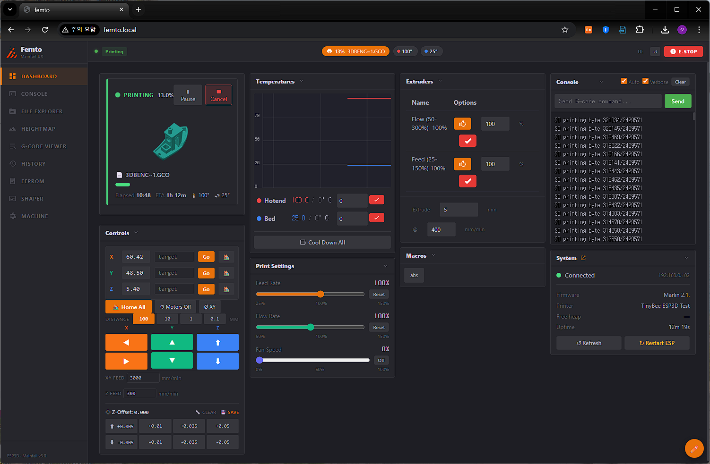
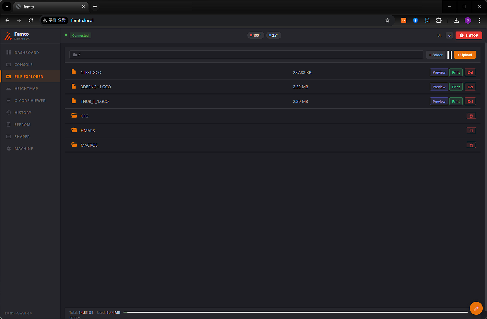
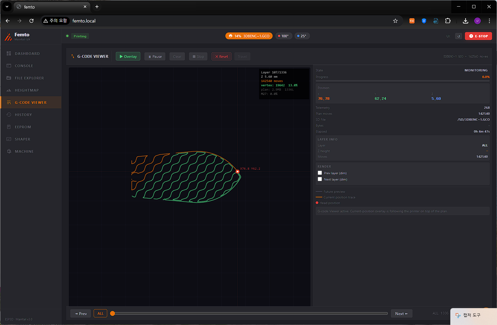
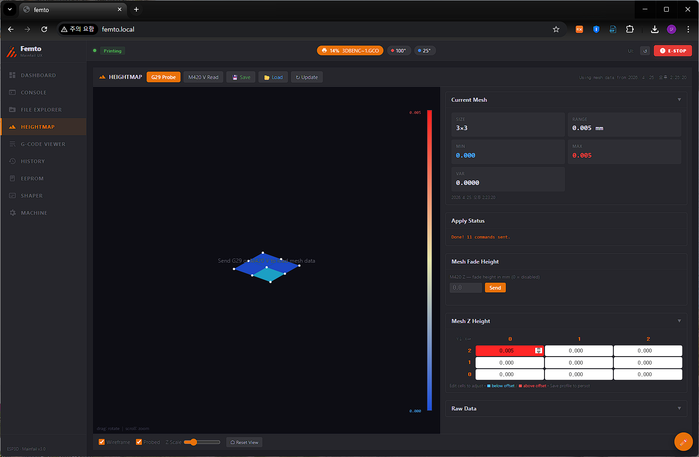
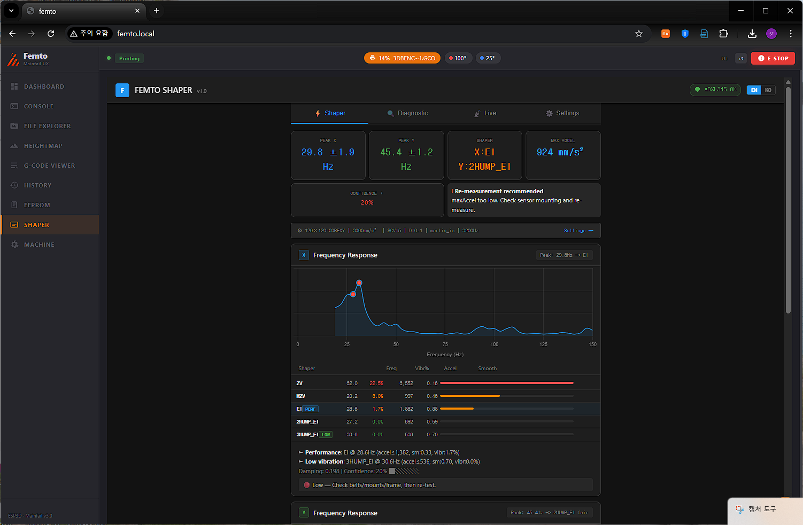
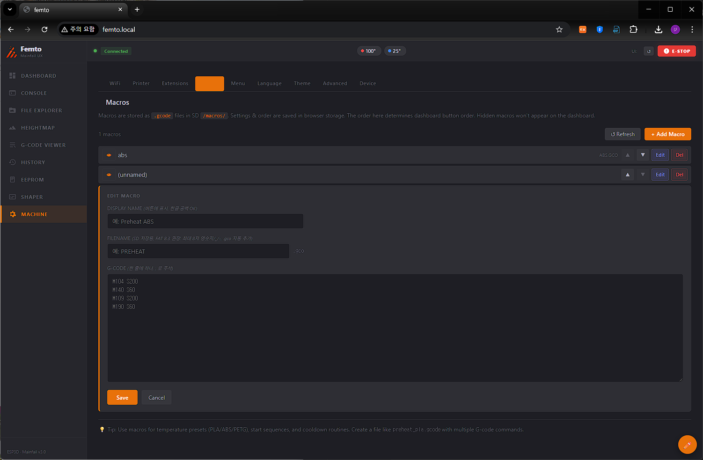
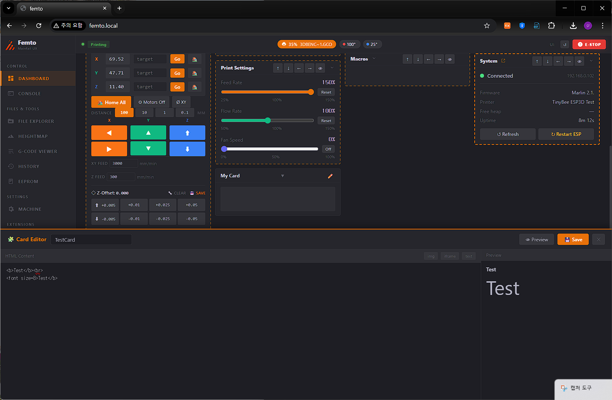
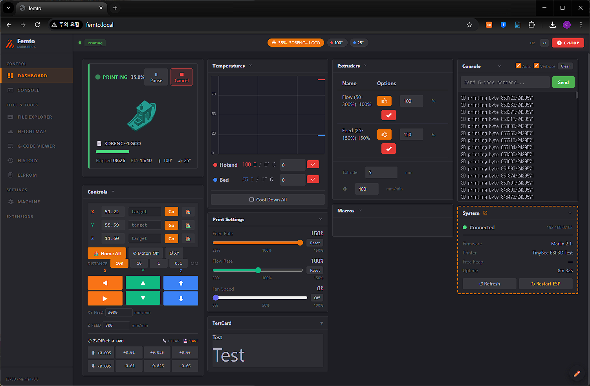

[README (ENG)](README.md) / [README (한국어)](README_KO.md)

# Mainfail UX

<p align="center">
  
  
</p>
<p align="center">
  
  
</p>
<p align="center">
  
  
</p>
<p align="center">
  
  
</p>
---

## What is Mainfail UX?

A frontend mod for ESP3D WebUI v2.1, running on MKS TinyBee (ESP32) + Marlin.

The original 601 KB JavaScript is untouched — zero modifications. The Mainfail shell, styles, viewer code, config bundle, language packs, and theme are embedded into a **single-file `index.html.gz` package**, while runtime config and printer-side data are loaded from the SD card. The result is a Mainsail-inspired dark UI on top of the same ESP3D WebSocket backend you already have.

- **Dashboard** — Card-based layout with drag-and-drop, show/hide per card, custom HTML cards
- **G-code Viewer + Live Path** — Manual SD G-code preview + real-time toolhead tracking via M27 byte-offset with future-path overlay and auto-pan
- **Print status** — Progress, ETA, thumbnail extraction (PrusaSlicer / OrcaSlicer / Cura / Creality)
- **Temperature chart** — Smoothie.js real-time graph, per-sensor color
- **EEPROM editor** — M503 capture, inline edit, M500 save
- **Heightmap** — G29 mesh visualization, editable Z-offset cells, save/load named profiles to SD
- **Macro editor** — Create, edit, reorder, run from SD
- **WiFi settings** — STA/AP mode switch with AP-fallback detection
- **Theme** — 3-color picker (accent / background / text), rest auto-calculated, 5 presets
- **Extensions** — Add custom tabs (iframe or HTML) from SD
- **Print history** — Logged to SD, persists across reboots
- **SD write protection** — All SD writes blocked or deferred during printing to prevent card lockup

Access: `http://<printer-ip>/` or `http://femto.local/` (if mDNS configured)

---

## Wait, what's FEMTO?

**FEMTO** is a budget 3D printer building competition held by the [DCinside 3D Printing Minor Gallery](https://gall.dcinside.com/mgallery/board/lists/?id=3dprinting), a Korean 3D printing community.

There was once a printer sold in Korea under the name "Sondori Pico" (an Easythreed rebrand). Its quality was so toy-like that it became a meme — whenever someone called a printer cheap, the community would say "at least it's better than Pico."

FEMTO pays homage to that Pico — the challenge is to build a printer that's **even cheaper than Pico, but actually works**. The name comes from the SI prefix: Pico is 10⁻¹², Femto is 10⁻¹⁵. Smaller, cheaper, yet functional.

### FEMTO Family

Developed for the FEMTO competition, but each module works as a standalone unit with any 3D printer — or anything else, really.

| Project | Description | Platform | Status |
|---------|-------------|----------|--------|
| **FEMTO Nano XY** | Ultra-budget DIY 3D printer (competition entry) | Marlin | In development |
| **[FEMTOCAM](https://github.com/meph6346-max/FEMTOCAM)** | Streaming & timelapse camera module | ESP32-CAM | Released |
| **FEMTO Shaper** | Standalone input shaping module | ESP32-C3 + ADXL345 | In development |
| **Mainfail UX** | ESP3D WebUI mod (this repo) | ESP32 + SD | In development |

FEMTO Shaper can be embedded as an extension tab inside Mainfail UX via SD — no separate browser tab needed.

---

## Why build this?

The goal of FEMTO is an ultra-budget printer. Using Klipper would require an SBC like a Raspberry Pi, and that alone could blow the budget. So **Marlin** was the obvious choice — one mainboard, no SBC.

But Marlin has a gap: the web UI is stuck in 2015.

Bootstrap 3, grey background, tab-based navigation. It works. It's just uncomfortable to use every day, and nothing like what you'd expect in 2025.

With Klipper, you get [Mainsail](https://github.com/mainsail-crew/mainsail) — a clean, modern, card-based dashboard with a dark theme. That's what Marlin deserved too.

So the plan became: **replace the ESP3D frontend, leave the backend alone.**

Replacing the backend (the 601 KB JS that handles WebSocket, authentication, and all printer communication) would mean maintaining a fork forever. Instead, Mainfail UX:

1. **Kept the original JS intact** — All WebSocket comms, M-code handling, and printer logic unchanged
2. **Replaced the shell layer** — Sidebar navigation, card-based dashboard, dark theme
3. **Extended via hooks** — Wrapped key ESP3D functions (`Monitor_output_Update`, `files_print`, etc.) to add new behavior without modifying the original
4. **Bundled the frontend into one upload file** — Mainfail CSS, JavaScript, viewer code, config, language data, and theme ship inside the uploaded `index.html.gz`
5. **Still uses SD where it matters** — Config, themes, macros, extensions, history, and G-code files are loaded from `/cfg/`, `/macros/`, `/hmaps/` at runtime

The result: a Mainsail-style UI on a stock Marlin + ESP3D setup, no SBC required.

---

## Target Environment

| Item | Value |
|------|-------|
| MCU | ESP32 (MKS TinyBee, etc.) |
| Firmware | Marlin 2.x + ESP3D WebUI v2.1 |
| SPIFFS | Single `index.html.gz` (~328 KB) |
| SD card | Required for full config/history/macro/preview workflow |
| Browser | Chrome, Firefox, Safari |

---

## Installation

### Step 1: Upload the WebUI package

Upload `index.html.gz` to ESP32 SPIFFS.

```text
dist/standard/index.html.gz
```

- Via ESP3D start screen upload flow
- Or via the local uploader: `dist/uploader/mainfail-webui-uploader.html`
- Or via esptool / PlatformIO

### Step 2: First boot

On first boot, Mainfail UX uses bundled defaults and creates its config directories on the SD card:

```
/cfg/mainfail.cfg       ← main config
/cfg/theme.cfg          ← saved theme
/cfg/layout.cfg         ← dashboard card layout
/cfg/history.cfg        ← print history
/cfg/extensions.cfg     ← custom sidebar tabs
/cfg/card_*.cfg         ← custom dashboard cards
/macros/*.gco           ← macro files
/hmaps/*.json           ← heightmap profiles
```

---

## Architecture

```
index.html.gz  (single file, ~328 KB gzip)
│
├── script[9]   ESP3D original JS (601 KB, zero modifications)
├── script[11]  Boot chain loader (CSS inject → JS inject → SD config load → connect)
└── <script id="mf-standard-assets">
    ├── mainfail_js      Main logic + hooks
    ├── mainfail_css     Styles + CSS variables
    ├── gcode_viewer_js  G-code Viewer + LivePath v3.0 (TypedArray parser)
    ├── mainfail_cfg     Default config bundle
    ├── lang_en / lang_ko
    └── theme_default
```

### Boot sequence

```
CSS inject (15%)
→ JS inject (30%)
→ GET /SD/cfg/theme.cfg (50%)
→ GET /SD/cfg/mainfail.cfg (70%)
→ machineInfo restore (80%)
→ extensions.cfg preload (95%)
→ ESP3D WebSocket connect
```

### Console pipeline

```
ESP3D WebSocket
  → Monitor_output_Update [hooked]
      → mf_interceptLine (single parse pipe)
          ├─ EEPROM capture  → mf_parseEepromLine
          ├─ Mesh capture    → mf_parseMeshLine
          ├─ X:Y:Z position  → mf_parseM114
          ├─ SD progress     → mf_printStatusUpdate (M27 byte-offset)
          ├─ Print complete  → mf_setState('idle') + SD flush queue
          └─ LivePath        → mf_livePathHandleLine
```

### G-code Viewer — memory model (v3.0)

Previous builds stored G-code moves as JS objects — 64 bytes each. At 600k moves (a typical 2-hour print), that's 36 MB just for the plan array.

v3.0 switches to TypedArrays:

```
Float32Array gcX, gcY, gcZ   ← coordinates
Uint8Array   gcFlags         ← bit 0: extruding
Uint16Array  gcLayer         ← layer index per vertex
```

11 bytes per move instead of 64. **5.8× reduction.**

Parsing runs in 4,000-line chunks with `setTimeout(0)` between them — the UI stays responsive during load. The completed plan renders to an offscreen canvas; only live-path points redraw each frame.

### G-code Viewer — live layer tracking

Early approaches tried to match the toolhead XY position to the nearest G-code vertex. This produced wild layer jumps (1→2→2→30→46) because the purge line XY overlaps with early print layers.

The current approach uses **M27 SD byte-offset** as the tracking signal:

```
splitIndex = Math.floor(gcProgress × gcCount)
```

`gcProgress` (`printed_bytes / total_bytes`) is a strictly monotone value from the firmware — it never jumps backwards. Combined with `_plastZ = Infinity` initialization (prevents the first Z move from triggering a false layer increment), layer tracking is now accurate from layer 1.

### SD write protection

Writing to the SD card during a print can cause the card to become unresponsive — requiring a physical re-insert.

Mainfail UX blocks or defers all SD writes when `mf_state === 'printing' || 'paused'`:

| Operation | Behavior |
|-----------|----------|
| Config files (`*.cfg`) | Deferred to queue → flushed automatically after print ends |
| Heightmap save / delete | Blocked with toast warning |
| Macro save / delete | Blocked with toast warning |

---

## Known Limitations

- **WiFi recovery**: If STA credentials are wrong, the ESP32 becomes unreachable over WiFi. Recovery requires serial: `[ESP401]P=0 T=B V=2` → `[ESP444]RESTART`
- **ESP3D version**: Tested against ESP3D WebUI v2.1 only. v3.x has a different architecture and will not work
- **G2/G3 arcs**: Not supported in the G-code viewer (treated as no-ops)
- **FAT 8.3 filenames**: All user-input SD filenames are normalized to 8-character base + 3-character extension (uppercase, alphanumeric only)
- **Large files**: The G-code viewer loads large files, but files over ~20 MB may be slow on mobile browsers

---

## Behind the Scenes

This project was built by a non-developer using **vibe coding with Claude AI**.

Architecture design, DOM compatibility analysis, hook injection, SD module design, bug hunting, and cross-validation — all done through conversation with an AI. The original ESP3D JS was treated as an untouchable black box, and every feature was built around it without touching a single line.

There are bugs. There are edge cases that haven't been hit yet. If you find one, open an issue.

---

## License

GPL v3 — following ESP3D-WEBUI's license.

---

## Acknowledgements

- [ESP3D](https://github.com/luc-github/ESP3D) / [ESP3D-WEBUI](https://github.com/luc-github/ESP3D-WEBUI) — luc-github
- [Mainsail](https://github.com/mainsail-crew/mainsail) — mainsail-crew
- We borrowed the name. And the design. Sorry.

---

*Mainfail UX is part of the [FEMTO family](https://gall.dcinside.com/mgallery/board/lists/?id=3dprinting) — built for the DCinside budget printer competition.*  
*Cheaper than Pico. Smaller than Pico. Actually works.*
