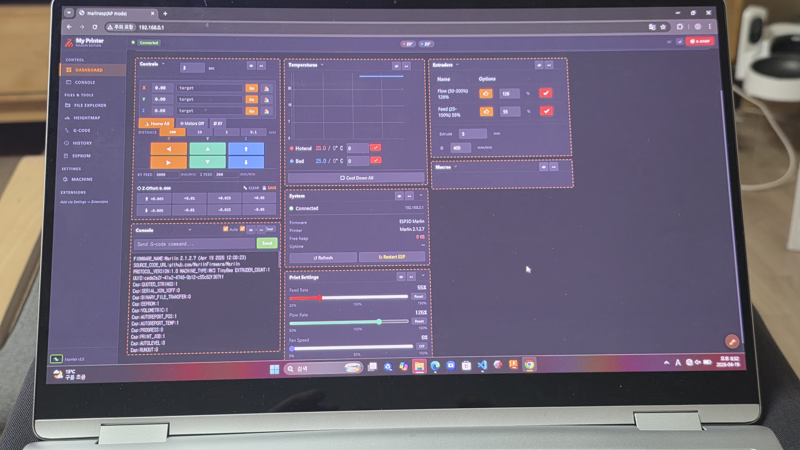
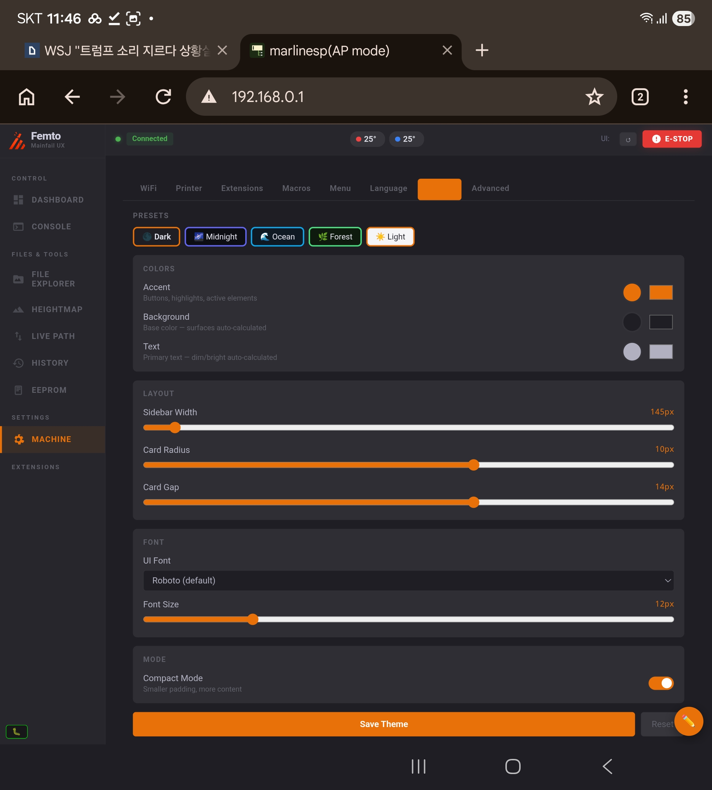
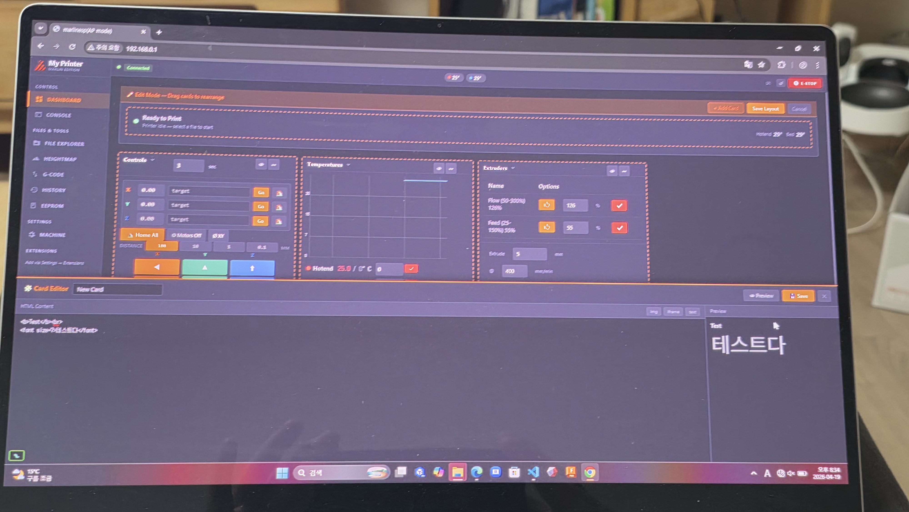
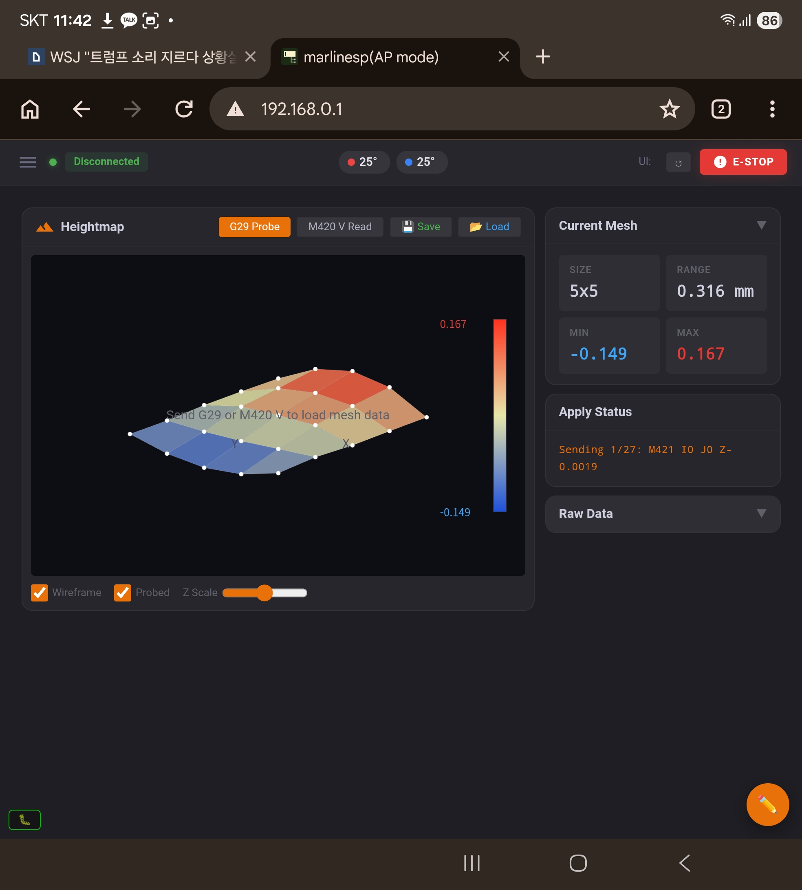

[README (ENG)](README.md) / [README (한국어)](README_KO.md)

# Mainfail UX

<p align="center">
  
  
</p>
<p align="center">
  
  
</p>

---

## Mainfail UX가 뭔가요?

MKS TinyBee (ESP32) + Marlin 환경에서 돌아가는 ESP3D WebUI v2.1용 프론트엔드 모드입니다.

원본 601KB JavaScript는 **한 줄도 수정하지 않았습니다.** Mainfail 셸, 스타일, 뷰어 코드, 설정 번들, 언어팩, 테마는 **단일 `index.html.gz` 패키지** 안에 넣고, 런타임 설정과 프린터 쪽 데이터는 필요할 때 SD 카드에서 읽어옵니다. 결과적으로, 이미 익숙한 ESP3D WebSocket 백엔드 위에 Mainsail 느낌의 다크 UI를 얹은 셈입니다.

- **Dashboard** — 카드 기반 레이아웃, 드래그 앤 드롭, 카드별 표시/숨김, 커스텀 HTML 카드
- **G-code viewer + Live Path** — SD 파일을 수동으로 불러와 미리보기 가능, 그리고 M114/M154/M27 기반 실시간 툴헤드 추적 + 미래 경로 오버레이
- **Print status** — 진행률, ETA, 썸네일 추출 (PrusaSlicer / OrcaSlicer / Cura / Creality)
- **Temperature chart** — Smoothie.js 기반 실시간 그래프, 센서별 색상
- **EEPROM editor** — M503 캡처, 인라인 편집, M500 저장
- **Bed mesh viewer** — G29 출력 기반 Heightmap 시각화
- **Macro editor** — SD에서 생성, 수정, 정렬, 실행
- **WiFi settings** — STA/AP 전환, AP fallback 감지
- **Theme** — 3색 선택기(포인트 / 배경 / 텍스트), 나머지는 자동 계산, 5개 프리셋
- **Extensions** — SD에서 iframe 또는 HTML 기반 커스텀 탭 추가
- **Print history** — SD에 기록, 재부팅 후에도 유지

접속 주소: `http://<printer-ip>/` 또는 `http://mainfail.local/` (mDNS가 설정된 경우)

---

## 잠깐, FEMTO가 뭐죠?

**FEMTO**는 한국의 3D 프린팅 커뮤니티인 [디시인사이드 3D프린팅 마이너 갤러리](https://gall.dcinside.com/mgallery/board/lists/?id=3dprinting)에서 진행하는 초저가 3D 프린터 제작 대회입니다.

예전에 한국에 “손도리 피코”라는 이름으로 팔리던 프린터가 있었습니다. 사실상 Easythreed 리브랜딩이었는데, 품질이 너무 장난감 같아서 밈이 되어버렸죠. 누가 프린터를 싸구려라고 하면 커뮤니티에서는 “그래도 피코보단 낫다”라고 말하곤 했습니다.

FEMTO는 그 피코를 패러디한 이름입니다. 목표는 **피코보다 더 싸지만, 진짜로 쓸 수 있는 프린터**를 만드는 것. 이름도 SI 접두어에서 따왔습니다. Pico는 10⁻¹², Femto는 10⁻¹⁵. 더 작고, 더 싸고, 그런데 그래도 동작하는 물건.

### FEMTO 패밀리

FEMTO 대회를 위해 개발되었지만, 각 모듈은 개별적으로도 3D 프린터든 뭐든 다른 프로젝트에 붙여 쓸 수 있습니다.

| 프로젝트 | 설명 | 플랫폼 | 상태 |
|---------|-------------|----------|--------|
| **FEMTO Nano XY** | 초저가 DIY 3D 프린터 (대회 출품작) | Marlin | 개발 중 |
| **[FEMTOCAM](https://github.com/meph6346-max/FEMTOCAM)** | 스트리밍 & 타임랩스 카메라 모듈 | ESP32-CAM | 출시됨 |
| **FEMTO Shaper** | 독립형 Input Shaping 모듈 | ESP32-C3 + ADXL345 | 개발 중 |
| **Mainfail UX** | ESP3D WebUI 모드 (이 저장소) | ESP32 + SD | 개발 중 |

---

## 왜 이걸 만들었나?

FEMTO의 목표는 초저가 프린터입니다. Klipper를 쓰면 Raspberry Pi 같은 SBC가 필요하고, 그 자체로 이미 예산이 흔들립니다. 그래서 답은 자연스럽게 **Marlin**이었죠. 메인보드 하나, SBC 없음.

그런데 Marlin에는 빈틈이 있습니다. 웹 UI가 2015년에 멈춰 있어요.

Bootstrap 3, 회색 배경, 탭 기반 네비게이션. 동작은 합니다. 다만 매일 쓰기엔 영 불편하고, 2024년 이후의 감각과는 거리가 멉니다.

Klipper 쪽으로 가면 [Mainsail](https://github.com/mainsail-crew/mainsail) 같은 깔끔한 다크 테마 카드형 대시보드를 쓸 수 있죠. Marlin도 그런 걸 가질 자격은 있다고 생각했습니다.

그래서 계획은 이렇게 정리됐습니다. **ESP3D 프론트엔드만 바꾸고, 백엔드는 그대로 둔다.**

백엔드, 그러니까 WebSocket, 인증, 프린터 통신 전부를 처리하는 601KB짜리 JS를 갈아엎는 건 곧 영원한 포크를 떠안는 일입니다. 대신 Mainfail UX는:

1. **원본 JS를 그대로 유지했습니다** — WebSocket 통신, M-code 처리, 프린터 로직은 그대로
2. **셸 레이어를 교체했습니다** — 사이드바 네비게이션, 카드형 대시보드, 다크 테마
3. **훅으로 확장했습니다** — `Monitor_output_Update`, `files_print` 같은 핵심 함수를 감싸 새 동작을 추가하되 원본은 수정하지 않음
4. **프론트엔드를 단일 업로드 파일로 묶었습니다** — Mainfail CSS, JavaScript, 뷰어 코드, 설정, 언어 데이터, 테마를 `index.html.gz` 하나에 포함
5. **필요한 곳에서는 SD를 그대로 사용합니다** — 설정, 테마, 매크로, 확장 탭, 히스토리, G-code 파일은 런타임에 `/sd/`와 `/sd/cfg/`에서 읽을 수 있음

결과적으로, SBC 없이도 stock Marlin + ESP3D 환경에서 Mainsail 느낌의 UI를 쓸 수 있게 되었습니다.

---

## 대상 환경

| 항목 | 값 |
|------|-------|
| MCU | ESP32 (MKS TinyBee 등) |
| 펌웨어 | Marlin 2.x + ESP3D WebUI v2.1 |
| SPIFFS | 단일 `index.html.gz` (~283KB) |
| SD 카드 | 전체 설정/히스토리/매크로/프리뷰 워크플로우를 위해 권장됨 (없어도 번들 기본값으로 부팅은 가능) |
| 브라우저 | Chrome, Firefox, Safari |

---

## 설치

### 1단계: WebUI 패키지 업로드

생성된 `index.html.gz`를 ESP32 SPIFFS에 업로드합니다.

권장 파일:

```text
dist/standard/index.html.gz
```

- ESP3D 시작 화면 업로드 방식 사용
- 또는 로컬 업로더 헬퍼 사용: `dist/uploader/mainfail-webui-uploader.html`
- 또는 esptool / PlatformIO 사용

### 2단계: 첫 부팅

첫 부팅 시 Mainfail UX는 번들된 기본 설정을 사용합니다. 사용자가 설정을 바꾸면 SD의 `/sd/cfg/` 아래에 저장됩니다.

```
/sd/cfg/mainfail.cfg      ← 메인 설정
/sd/cfg/theme.cfg         ← 저장된 테마
/sd/cfg/layout.cfg        ← 대시보드 카드 레이아웃
/sd/cfg/history.cfg       ← 출력 히스토리
/sd/cfg/extensions.cfg    ← 커스텀 사이드바 탭
/sd/cfg/card_*.cfg        ← 커스텀 대시보드 카드
```

SD 카드가 없더라도 UI는 번들된 단일 파일 패키지로 부팅됩니다. 다만 SD 기반 설정, 히스토리, 매크로, 파일 프리뷰 워크플로우는 제한됩니다.

---

## 아키텍처

```
index.html.gz  (single file, ~283KB)
│
├── script[9]   ESP3D 원본 JS (601KB, zero modifications)
├── script[11]  부트 체인 로더 (CSS inject → JS inject → SD config load → connect)
└── <script id="mf-standard-assets">
    ├── mainfail_js      메인 로직 + 훅 (213 functions)
    ├── mainfail_css     스타일 + CSS 변수
    ├── gcode_viewer_js  G-code viewer + LivePath v3.0 (41 functions, TypedArray parser)
    ├── mainfail_cfg     기본 설정 번들
    ├── lang_en / lang_ko
    └── theme_default
```

### 부팅 순서

```
CSS inject (15%)
→ JS inject (30%)
→ GET /sd/cfg/theme.cfg (50%)
→ GET /sd/cfg/mainfail.cfg (70%)
→ machineInfo restore (80%)
→ extensions.cfg preload (95%)
→ ESP3D WebSocket connect
```

### 콘솔 파이프라인

```
ESP3D WebSocket
  → Monitor_output_Update [hooked]
      → mf_interceptLine (single parse pipe)
          ├─ EEPROM capture  → mf_parseEepromLine
          ├─ Mesh capture    → mf_parseMeshLine
          ├─ X:Y:Z position  → mf_parseM114
          ├─ SD progress     → mf_printStatusUpdate
          ├─ Print complete  → mf_setState('idle')
          └─ LivePath        → mf_livePathHandleLine
```

### G-code Viewer 메모리 모델 (v3.0)

이전 빌드에서는 G-code move를 JS 객체 배열로 저장했습니다. move 하나당 약 64바이트, 600k moves 정도 되는 일반적인 2시간 출력이면 plan array만 36MB가 됩니다.

v3.0에서는 TypedArray로 바꿨습니다.

```
Float32Array gcX, gcY, gcZ   ← coordinates
Uint8Array   gcFlags         ← bit 0: extruding
Uint16Array  gcLayer         ← layer index
```

move 하나당 64바이트 대신 11바이트. **약 5.8배 감소**입니다.

파싱은 청크 단위(4,000 lines → `setTimeout(0)` → next chunk)로 진행되어 로딩 중에도 UI가 멈추지 않도록 했습니다. 완성된 plan은 offscreen canvas에 캐시하고, 프레임마다 다시 그려지는 건 live points뿐입니다.

지금 뷰어는 두 가지를 모두 지원합니다.

- **수동 SD 파일 preview** — Live Path 없이 파일만 열어 미래 경로 확인
- **실시간 telemetry tracking** — 현재/과거 이동 경로 확인

---

## 현재 한계

- **WiFi 복구**: STA 설정이 틀리면 ESP32가 WiFi에서 사라집니다. 복구는 시리얼로: `[ESP401]P=0 T=B V=2` → `[ESP444]RESTART`
- **ESP3D 버전**: ESP3D WebUI v2.1 기준으로 테스트됨. v3.x는 아키텍처가 달라서 그대로는 동작하지 않음
- **G2/G3 arcs**: G-code viewer에서 아직 지원하지 않음 (no-op 처리)
- **언어팩**: `lang_en`, `lang_ko`는 번들되어 있지만 번역 커버리지는 아직 미완성
- **대용량 파일**: 큰 파일도 로드할 수는 있지만, 20MB를 넘기면 모바일 브라우저에서는 여전히 느릴 수 있음

---

## 비하인드

이 프로젝트는 비전공자가 **Claude AI와 vibe coding**으로 만든 프로젝트입니다.

아키텍처 설계, DOM 호환성 분석, 훅 주입, SD 모듈 설계, 버그 헌팅, 교차 검증까지 — 전부 AI와의 대화 속에서 진행됐습니다. 원본 ESP3D JS는 손댈 수 없는 블랙박스로 취급했고, 모든 기능은 그 한 줄도 건드리지 않는 방향으로 쌓아 올렸습니다.

버그는 있을 겁니다. 아직 안 밟은 엣지 케이스도 분명히 있을 거고요. 찾으면 이슈 열어주세요.

---

## 라이선스

GPL v3 — ESP3D-WEBUI의 라이선스를 따릅니다.

---

## 감사의 말

- [ESP3D](https://github.com/luc-github/ESP3D) / [ESP3D-WEBUI](https://github.com/luc-github/ESP3D-WEBUI) — luc-github
- [Mainsail](https://github.com/mainsail-crew/mainsail) — mainsail-crew
- 이름도 빌렸고, 디자인도 빌렸습니다. 죄송합니다.

---

*Mainfail UX는 [FEMTO 패밀리](https://gall.dcinside.com/mgallery/board/lists/?id=3dprinting)의 일부입니다 — DCinside 초저가 프린터 대회를 위해 만들어졌습니다.*  
*피코보다 싸고. 피코보다 작고. 그래도 돌아갑니다.*
